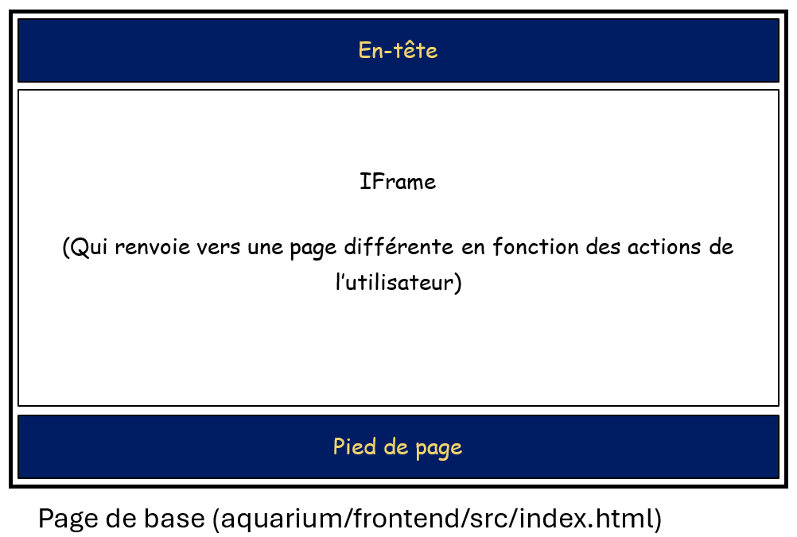

## À propos

Le projet AQUARIUM (Application de QUestionnement et d'Analyse des Relevés Informatiques pour l'identification des Vecteurs de Malveillance) a pour objectif de faciliter l'analyse de machines Windows potentiellement compromises.

Il a été fait par :
- Charles MAILLEY
- Cynthia CALIMOUTTOUPOULLE
- Flore PAVIOT-ADET
- Valentyna PRONINA
- Cécile ROLLAND

## Conditions d'utilisation

Il est strictement interdit d'utiliser le logiciel à des fins commerciales, y compris, mais sans s'y limiter, la vente, la location, la distribution ou toute autre forme de monétisation du logiciel.

L'utilisateur n'est pas autorisé à modifier, distribuer ou créer des œuvres dérivées du logiciel sans l'autorisation écrite préalable de l'équipe de développement.

Le logiciel est fourni 'tel quel', sans garantie d'aucune sorte, expresse ou implicite. L'équipe de développement ne sera en aucun cas responsable des dommages directs, indirects, spéciaux, accessoires ou consécutifs résultant de l'utilisation ou de l'incapacité à utiliser le logiciel

Ces conditions d'utilisation sont provisoires. Elles sont susceptibles d'évoluer sans que l'équipe de développement n'ait à s'en justifier.

## Installation du projet

1. Suivre le guide d'installation de Wials : [Wails](https://wails.io/docs/gettingstarted/installation).
2. Ouvrir un terminal dans le dossier où le projet a été téléchargé
3. Lancer la commande suivante : ``> wails dev``

## Architecture générale

Le logiciel Aquarium utilise le langage Go pour la logique applicative et les langage HTML, CSS et JavaScript pour la partie affichage.
Ces deux parties sont articulées grâce au compilateur Wails. 

## Structure du dossier d'analyse

Le dossier d'une analyse a la structure suivante : 
- ``collecteORC`` : dossier contenant les archives ORC partiellement décompressées
- ``analyse`` : dossier contenant les fichiers d'analyse générés par le logiciel
  - ``chronologie.db`` : base de donnée des évènements qui se sont déroulés sur la machine analysée. 
    - ``chronologie`` : la table contenant les évènements, qui contient les champs suivants :
      - ``id`` : l'identifiant de l'évènement
      - ``extracteur`` : l'identifiant de l'extracteur qui l'a écrit
      - ``horodatage`` : la date de l'évènement
      - ``source`` : le fichier duquel l'évènement a été extrait
      - ``message`` : le contenu de l'évènement
    - ``indicateurs`` : les indicateurs de compromission
      - ``id`` : identifiant de l'indicateur
      - ``type`` : type d'indicateur (ip, url, md5, ...)
      - ``valeur`` : valeur de l'indicateur
      - ``tlp`` : politique de diffusion (cf : https://www.cert.ssi.gouv.fr/csirt/politique-partage/)
      - ``pap`` : politique d'utilisation
      - ``commentaire`` : commentaire éventuel
    - ``indicateurs_evenements`` : table faisant le lien entre les indicateurs de compromission et les évènements dans lequels ils apparaissent
      - ``id_indicateur``
      - ``id_evenement``
  - ``arborescence.json`` : l'arborescence (partielle) du systeme de fichiers de la machine source 

## Interface graphique

La structure de l’interface graphique est la suivante :



L’entête contient des boutons qui renvoient vers les différents affichages de l’application. Ils ont la structure suivante : 

```html
<button id="identifiant" class="onglet" onclick="change_onglet('chemin/vers/l’onglet','identifiant')"> Nom de l’onglet</button>
```
Avec : 
- identifiant : un identifiant unique du bouton. Par convention, on le nommera avec « onglet_ » puis le nom de l’onglet.
- chemin/vers/l’onglet : le chemin qui permet d’accéder à l’onglet depuis la page aquarium/frontend/src/index.html.
- Nom de l’onglet : le nom de l’onglet, qui sera affiché à l’utilisateur.

Les styles communs à toute l’application (par exemple le style par défaut d’un bouton clair) sont enregistrés dans le fichier aquarium/frontend/src/main.css.

Pour appeler une fonction Go depuis l’un des onglets de l’interface graphique, on utilise le code suivant : 

```go
parent.window.go.main.App.FonctionGo().then(resultat=>{
	// Code à exécuter une fois que l’on a les résultats de la fonction Go
}
```

Avec FonctionGo le nom de la fonction Go que l’on souhaite appeler.
⚠️À noter : pour pouvoir être appelée depuis l’interface graphique, la fonction Go doit être écrite en suivant le modèle décrit dans la partie « Logique de l’application ».

## Logique de l’application

La logique de l’application (fonctions d’extraction d’évènements, de recherche de marqueurs, …) est écrite en Go.
Les fonctions Go pouvant être appelées depuis l’interface graphique sont écrites dans le fichier aquarium/app.go. Elles ont la structure suivante : 
```go
func (a *App) FonctionGo(arg1 type1, arg2 type2, …) (typeA, typeB, …) {
    // Logique de la fonction
    return resA, resB, …
}
```
Avec : 
- FonctionGo : le nom de la fonction Go
- arg... type... : les arguments de la fonction et leurs types
- res... type... : les valeurs renvoyées par la fonction et leurs types

### Modules d'extraction

Les opérations d'extraction de l'ORC sont séparés en modules, qui peuvent être exécutés sur un clic de l'utilisateur. 
Cela permet de réduire le temps de chargement de l'application à la création d'une analyse, et ainsi de permettre à l'utilisateur d'afficher une partie des évènements pendant l'extraction du reste des éléments. 

Ces modules comportent les fonctions suivantes : 
- ``Definition``, qui renvoie les informations sur la fonction de l'extracteur
- ``Extraction``, qui extrait les évènements choisis et les enregistre dans le fichier ``analyse/chronologie.db``
- ``PrerequisOK``, qui renvoit ``vrai`` si les conditions sont réunies pour que l'extraction puisse se faire.