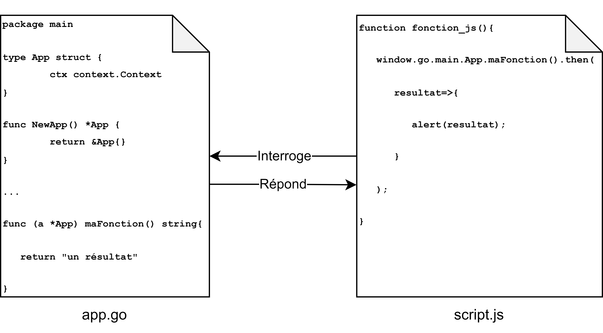
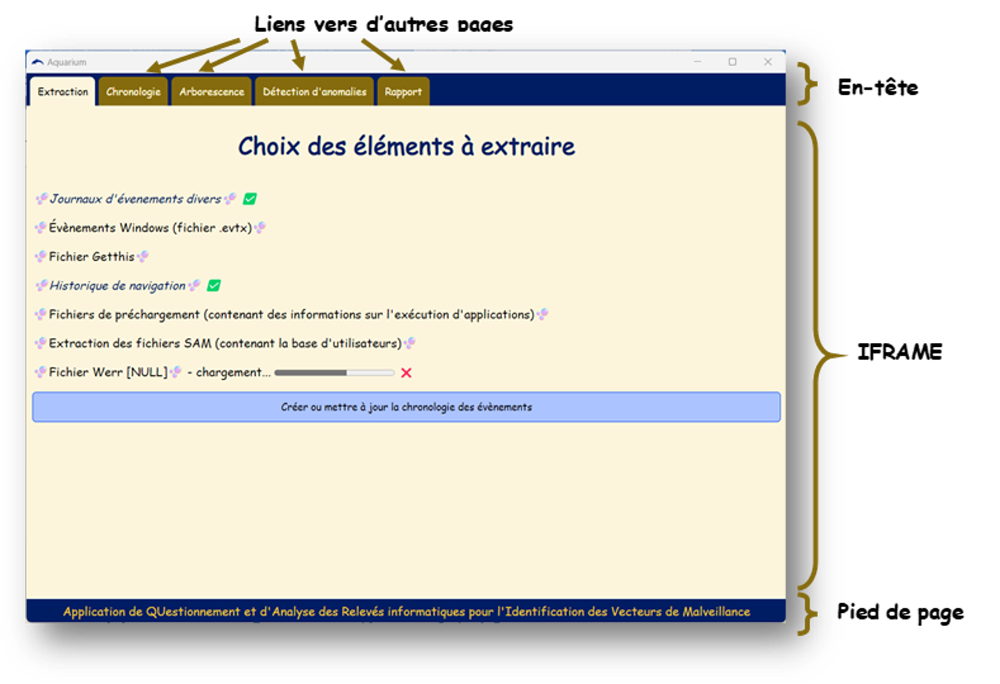

# Mots clé

aquarium - analyse forensique - forensic analysis - DFIR-ORC 

# Utilisation

> La manière la plus simple d'utiliser aquarium est de télécharger les releases. Elles contiennent des version compilées pour Windows et Linux

Pour compiler le projet, il est nécessaire d'installer [wails](https://wails.io/docs/gettingstarted/installation). On peut ensuite les compiler en utilisant la commande `wails build`:
```shell
$ git clone https://github.com/croll5/aquarium
$ cd aquarium/
$ wails build
```
Un exécutable est alors créé dans le dossier `build/bin`

> ⚠️ Pour qu'aquarium fonctionne correctement, vous devez copier le dossier `aquarium/ressources` dans le même dossier que l'exécutable.

Pour recompiler automatiquement le projet à chaque modification du code, vous pouvez utiliser la commande `wails dev`.

# Présentation des technologies utilisées

Notre projet utilise Wails, un cadriciel permettant de construire une application en utilisant le langage Go pour la logique applicative et les technologies Web pour l’interface graphique. La liaison entre le code en Go et le code en JavaScript se fait comme indiqué sur la figure ci-dessous :



## Choix du langage Go

Nous avons choisi d’utiliser le langage Go, développé par Google, en raison du bon rapport entre performance et simplicité d’utilisation qu’il offre. En effet, le langage Go présente la particularité de contraindre le développeur à une gestion très rigoureuse de la mémoire. En Go, la présence d’une variable initialisée ou simplement déclarée non utilisée dans la suite du code est considérée comme une erreur par le compilateur. Il est donc quasiment impossible de compiler un code contenant des variables totalement inutiles. 
De plus, en Go, les erreurs sont considérées comme un résultat normal des fonctions et traitées dans le flux standard du programme. Cette particularité est avantageuse pour un logiciel qui sera amené à traiter des données fortement hétérogènes et pouvant évoluer, dans lequel de nombreuses erreurs risquent par conséquent d’être générées. 
Enfin, le Go est relativement bien implanté dans le milieu de la cybersécurité. Il compte donc de nombreuses bibliothèques utiles à la cybersécurité qui nous ont facilité le développement. 

## Choix des technologies Web

Nous avons choisi d’utiliser les technologies Web en raison de leur relative simplicité d’utilisation, qui permet de créer facilement une interface graphique agréable d’utilisation. De plus, nous étions tous déjà formés à ces technologies grâce au projet d’APP que nous avons effectué en première année du cycle ingénieur. Cela nous évitait donc de nous former à un cadriciel supplémentaire, en plus du Go que la plupart d’entre nous ne connaissait pas encore.

## Gestion de la base de données

Nous avons choisi d’utiliser une base de données SQLite pour enregistrer les données extraites des collectes ORC. Il s’agit d’une bibliothèque en C permettant d’enregistrer des données manipulables grâce au langage SQL dans un unique fichier. Cela permet de tirer parti des avantages des bases de données SQL (facilité de requêtage, relative optimisation, organisation structurée,…) sans nécessiter le déploiement d’un serveur de bases de données. 

# Architecture du logiciel

## Interface graphique

L’interface graphique est constituée d’une page principale avec un en-tête et un pied de page, dans laquelle est contenue une « iframe » renvoyant dynamiquement vers les différentes pages à afficher. La figure ci-dessous illustre cette organisation :



Les fichiers de l’interface graphique sont organisés selon cinq dossiers : 

- Le dossier ``js``, qui contient les fonctions JavaScript utilisées par une seule page

- Le dossier ``css``, qui contient les pages de style utilisées par une seule page

- Le dossier ``html``, qui contient les pages HTML standard

- Le dossier ``template``, qui contient des pages communes à plusieurs pages, notamment :
  
  - ``commun_clair.css``, qui regroupe le style commun aux pages de style clair
  
  - ``commun_sombre.css``, qui regroupe le style commun aux pages de style sombre
  
  - ``bibliotheque.css``, qui regroupe le style utilisable depuis toutes les pages (notamment de styles associés à des classes
  
  - ``bibliotheque.js``, qui regroupe des fonctions JavaScript utilisables par toutes les pages

- Le dossier ``assets``, qui contient des ressources externes utilisables par le programme (images, polices, documents PDF, …)

## Logique applicative

Toutes les fonctions Go accessibles depuis l’interface graphique sont écrites dans le fichier app.go. Celles-ci utilisent des modules Go (codés dans des fichiers séparés) pour chaque fonctionnalité. 
Pour que le code puisse évoluer facilement, nous avons décidé de le séparer par « extracteurs ». Chaque extracteur permet la gestion d’un type de données contenues dans l’ORC. Il fournit des fonctions utilisées par le module « extraction » afin de gérer dans sa totalité le traitement des données qu’il prend en charge. 
Le module « extraction » est codé dans le fichier « aquarium/modules/extraction/extraction.go ». Il définit l’interface suivante : 

```go
type Extracteur interface {
    Extraction(string) error
    Description() string
    PrerequisOK(string) bool
    CreationTable(string) error
    PourcentageChargement(string, bool) float32
    Annuler() bool
    DetailsEvenement(int) string
    SQLChronologie() string
}
```

Tous les extracteurs implémentent les fonctions définies dans cette interface. Pour être utilisés par le code d’aquarium, ils sont intégrés dans le dictionnaire liste_extracteurs. 

```go
var liste_extracteurs map[string]Extracteur = map[string]Extracteur{
    "evtx":       evtx.Evtx{}, 
    "navigateur": navigateur.Navigateur{},
    "werr":       werr.Werr{},
    "sam":        sam.Sam{}, 
    "getthis":    getthis.Getthis{},
    "divers":     divers.Divers{},
    "prefetch":   prefetch.Prefetch{},
}
```

Voici un descriptif des fonctionnalités fournies par les fonctions de l’interface Extracteur :

- ``Extraction(string)`` : cette fonction permet d’extraire les données qui intéressent l’extracteur et de les ajouter dans la base de données « extraction.db », contenant toutes les données extraites. Elle prend en argument le chemin d’enregistrement de l’analyse.

- ``Description()`` : cette fonction fournit une description des données traitées par l’extracteur

- ``PrerequisOK(string)`` : cette fonction renvoie « vrai » si et seulement si la capture ORC analysée contient les fichiers permettant d’extraire les données qui intéressent l’extracteur. Elle prend en argument le chemin d’enregistrement de l’analyse. 

- ``CreationTable(string)`` : cette fonction permet de créer toutes les tables utilisées par l’extracteur dans la base de données « extraction.db ». Elle prend en argument le chemin d’enregistrement de l’analyse

- ``PourcentageChargement(string, bool)`` : cette fonction renvoie une estimation du pourcentage de chargement de l’extraction. Elle prend en argument le chemin d’enregistrement de l’analyse et un booléen indiquant s’il est nécessaire de vérifier si l’extracteur a déjà été exécuté avec succès pour cette analyse.

- ``Annuler()`` : cette fonction permet d’annuler une extraction en cours.

- ``DetailsEvenement(int)`` : cette fonction n’est pas encore utilisée par le code de l’aquarium (cf. partie V – ce qui pourrait être ajouté). Elle permettra d’obtenir plus d’informations sur un évènement spécifique extrait par l’extracteur.

- ``SQLChronologie()`` : cette fonction renvoie le code SQL permettant d’ajouter les données extraites par l’extracteur à une table commune, la table « chronologie », qui contient un résumé condensé de tous les évènements extraits.  
